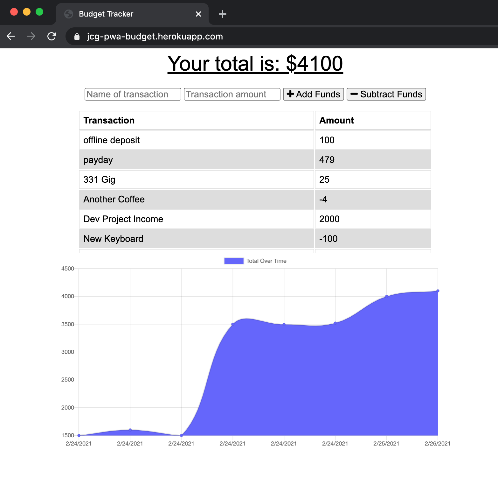
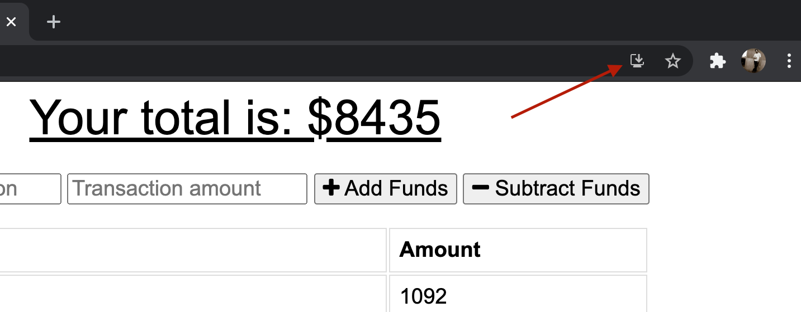

# Offline Budget Tracker

## Table of Contents

- [Installation](#installation)
- [Usage](#usage)
- [Credits](#credits)
- [License](#license)
- [Contributing](#contributing)
- [Tests](#tests)

## Description

Need to track your budget while on the go - with potentially interrupted internet connections? Offline Budget is for you. A simple Progressive Web Application that will track your deposits and expenses whether you're online or off. When you come back online, you're data is updated.

### Screenshot

## Installation

There should be an icon in the address bar of your browser to install the application for offline use. If using Chrome, it should look like this...

## Usage

You can enter your deposits and expenses. This works whether or not you have an internet connection, then is updated when the connection is back. _Note_: you may have to refresh the browser once or twice once you have a connection again to see transactions that were entered offline.

## Credits

Webpack, Babel, IndexedDB, and Compression libraries were used for this project. Their accompanying documentation was very helpful. Special thanks to the Heroku documentation on building with Webpack.

- [Webpack](https://webpack.js.org/)
- [Babel](https://babel.dev/docs/en/babel-core)
- [Compression](https://www.npmjs.com/package/compression)
- [IndexedDB](https://developer.mozilla.org/en-US/docs/Web/API/IndexedDB_API)

## License

Licensed under the MIT license.

## Contributing

Contributions are welcome. If you are interested in contributing to this project, please open a pull request. Bug fixes, feature requests, and documentation updates/fixes are all encouraged.

## Tests

`npm run test` - currently only running ESLint.

## Questions?

Please contact me via email at goul0076@gmail.com with any questions.
